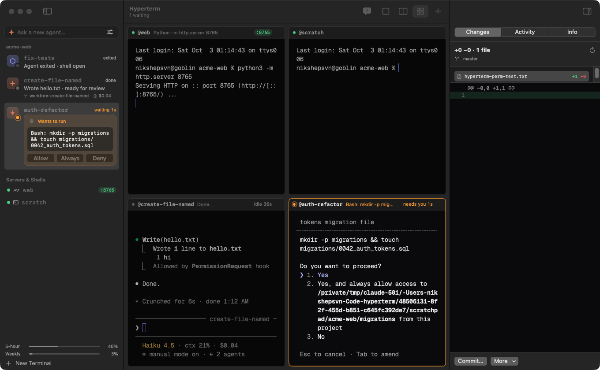

# Hyperterm

**A native macOS terminal for running many coding agents at once.** Claude Code, Codex, shells and dev servers each get a labeled terminal (`@api`, `@landing-page`). Hyperterm shows what every agent is doing, brings you the ones that need you, lets you approve and review their work without switching terminals, and lets agents message each other by label.



Terminals render with **libghostty**, Ghostty's own GPU (Metal) engine. Your `~/.config/ghostty/config` (fonts, theme, keybinds) applies as-is. The app chrome is native AppKit and SwiftUI: a translucent glass window, floating rounded terminal panes, a unified toolbar, a server strip, and a system inspector.

## Why

Running several agents in parallel moves the bottleneck from typing to **attention and review**. You need to know which agent is blocked on an approval, which one finished with a diff to look at, and which one is burning your rate limit. Hyperterm is built around those questions instead of around tabs.

## Features

### See every agent at a glance
- **Sidebar of agents, grouped by repository.** Each card shows the agent's state (working, waiting on you, done, failed), what it's doing right now (`Bash: pnpm test`, `Edit: src/auth.ts`), its own status line, Claude's todo progress (`3/5 · Writing migration`), branch, test result, and cost.
- **Stable positions.** Cards never reorder when states change, so ⌘1–9 and muscle memory keep working. Attention is shown, not sorted.
- **Grid, split, or focus.** Every live terminal as a tile (⌘⌥3), the last two side by side (⌘⌥2), or one (⌘⌥1). ⌘⏎ zooms a tile. Unfocused tiles dim slightly.
- **Since you left.** Come back to an agent and a banner sums up what happened: edits, commands, approvals, tests, and the final answer.

### Answer approvals from anywhere
- **Real approvals, not keystrokes.** Hyperterm installs Claude's `PermissionRequest` hook (per launch, never in your global settings). The moment an agent asks, its card shows the exact command with **Allow / Always / Deny**. Always saves the rule Claude suggested, and Deny can carry a reason the agent sees. Claude's own dialog still works in the terminal, and whichever answer comes first wins.
- **From the notification banner.** Allow or Deny straight from macOS notifications. The menu bar shows the waiting count.
- **Codex:** approvals from Hyperterm work after you enable the hook once (App menu → *Enable Codex Approvals in Hyperterm…*). Until then, Codex prompts are answered by choosing the numbered option on screen.

### Review the work
- **Ready for review.** When an agent finishes with changes, its card shows `+128 −41`. The inspector (⌥⌘R) shows the diff against the branch it started from.
- **Comment on lines.** Double-click a diff line to comment; *Send comments* delivers them to the agent as one message.
- **Finish it.** Commit, open a PR (via `gh`), merge into the base branch (refused if the main checkout is dirty or on another branch), or archive the worktree. Archiving commits leftover work to the branch first, so nothing is lost.

### Isolated workspaces
- **Quick dispatch.** Type a task in the sidebar's *Ask a new agent…* field and press Return. A new agent starts on it, auto-named from the task, in its own git worktree.
- **Claude's native worktrees** (`claude --worktree`) for Claude sessions: Claude blocks writes back into the main checkout and copies `.worktreeinclude` files (like `.env`). Codex gets a worktree under `~/.hyperterm/worktrees` with the same files copied in.
- **Per-project dev setup.** Add `.hyperterm.json` to a repo:
  ```json
  { "setup": "pnpm i", "dev": "pnpm dev --port $PORT", "ports": [4100, 4199] }
  ```
  Each new workspace gets its own port (`$PORT` and `$HT_PORT` in the agent's environment), and a labeled dev-server terminal starts next to it.
- **Clean up** (Terminal → *Clean Up Worktrees…*) lists agent worktrees with merged/unmerged status and archives the leftovers.

### Browsers agents can drive
- **Real Chromium inside Hyperterm.** Browsers are sessions like terminals: labeled (`@api-web`), in the sidebar under their agent, tiled in split and grid, and restored where they left off. ⇧⌘B opens one, on the selected terminal's dev server when it has one.
- **Every agent gets its own.** An agent's first browser action opens `@<agent>-web` next to it, and its tools act on that browser by default, so parallel agents never fight over a page. `list_pages` names every Hyperterm browser by label, and an agent can use another one by passing its page id.
- **Watch and step in.** The tile shows who is driving (`@api · click`), and you can click, type, and log in yourself at any time.
- **Your logins, if you want them.** *Import Chrome Logins…* (in a browser's ⋯ menu) copies your Chrome cookies into Hyperterm's browser profile, which is kept separate from your own Chrome (`~/.hyperterm/browser`).
- **Scoped by default.** Agents started in Hyperterm use Hyperterm's browsers, not your everyday Chrome. App menu → *Let Agents Use My Chrome* re-enables Claude in Chrome for them.

Agents drive the browsers through [`chrome-devtools-mcp`](https://github.com/ChromeDevTools/chrome-devtools-mcp) (Node.js required), attached to Chromium's DevTools port on 127.0.0.1. Read-only tools (snapshots, screenshots, console, network) run without asking; navigating, clicking, typing, and scripts ask first.

### Agents that talk to each other
Every agent started in Hyperterm gets a `hyperterm` MCP server:

| Tool | What it does |
|---|---|
| `list_terminals` | Who's doing what: state, summary, ports, branch |
| `send_message` | Message another agent by `@label` |
| `read_terminal` | Read an agent's or server's output, e.g. dev-server logs |
| `set_status` | Post a one-line status to its card |
| `rename_terminal` | Rename itself as the work changes (`@auth-refactor` → `@fix-login`); old names keep working |
| `start_server` / `restart_server` | Run dev servers in their own labeled terminals. Starting one asks you first |

Claude sessions are launched as `claude --name <label>`, so Claude's built-in cross-session messaging (`SendMessage`, `@mentions`) uses the same names. Messages wait until the receiving agent is at an empty prompt. They're never typed into a dialog or into something you're halfway through writing. Optional (App menu): deliver messages through Claude's **channels** API instead of typing.

### Usage
The sidebar shows your 5-hour and weekly usage with reset times, taken from Claude's statusLine data (your own statusline still prints unchanged). Each card shows cost and the inspector shows context use. When an agent hits a rate limit, its card says when the limit resets, not just "failed".

## Security model

Hyperterm types into terminals on your behalf, so who may ask for what matters. The control socket (`~/.hyperterm/control.sock`, user-only) identifies every caller from **kernel facts** (peer PID, process ancestry, and macOS's *responsible process*), never from anything the caller claims:

- **You:** processes outside Hyperterm, or inside your own shell/server terminals.
- **Agents:** anything traced to an agent terminal. Agents can message other agents, read agents and servers (not shell scrollback), restart servers, start servers with your OK, set their own status, and rename only themselves (never over a name you chose).
- **Untrusted:** anything that came from inside Hyperterm but escaped its session (backgrounded, double-forked, reparented to launchd). Read-only.

Only you can press keys, answer prompts, type raw text, open shells, or close terminals. That stops one agent from approving another's permission prompt or running commands outside its own checks. Session IDs and tasks typed into shells are validated and shell-quoted, peer messages are stripped of control and escape sequences, and git runs with repo hooks and fsmonitor disabled.

**Limit:** this is a boundary between agents and Hyperterm, not an OS sandbox. An agent you allow to drive other apps (for example via `osascript`) could act outside it. Claude's sandbox mode closes that gap.

## Nothing global is modified

Hooks, the statusLine, the MCP server and permissions are attached **per launch** through wrappers in `~/.hyperterm/bin` (`claude --settings … --mcp-config …`, `codex -c …`). They merge with your settings; your existing hooks keep running. `~/.claude/settings.json` and `~/.codex/config.toml` are never written. Two opt-in menu items write config, and each asks first: channels (`claude mcp add --scope user hyperterm`) and Codex approvals (`~/.codex/hooks.json`).

## `ht` CLI

Add `export PATH="$HOME/.hyperterm/bin:$PATH"` to `~/.zshrc` (App menu → *Use ht in Your Shell…*).

```sh
ht ls                                           # label · kind · state · ports · summary
ht new claude --cwd ~/Code/app --worktree --task "fix the flaky auth test"
ht new server @web -- pnpm dev                  # also: codex, shell
ht send @api "users.name is now display_name"   # message an agent
ht approve @api   ·   ht always @api   ·   ht deny @api "use a migration instead"
ht read @web -n 50                              # recent output
ht key @api down enter                          # press keys
ht layout grid   ·   ht focus @ui   ·   ht restart @web   ·   ht rename @api backend   ·   ht close @scratch
```

## Keyboard

| | |
|---|---|
| ⌘N / ⌘T / ⇧⌘C / ⇧⌘X | New terminal / shell here / Claude here / Codex here |
| ⌘P | Go to a terminal, run an action, or `@label message` |
| ⇧⌘U | Jump to the agent waiting longest |
| ⌥⌘R / ⌥⌘I | Review changes / toggle inspector |
| ⌘⌥1 · 2 · 3, ⌘⏎ | Focus · split · grid, zoom tile |
| ⌘F, ⌘G | Find in terminal (scrollback included) |
| ⇧⌘O | Open the selected server's port in a preview window |

## How status is detected

| Signal | Used for |
|---|---|
| Claude hooks: `UserPromptSubmit`, `PreToolUse`, `PostToolUse(Failure)`, `PermissionRequest`, `Notification`, `Stop`, `StopFailure`, `TaskCreated/Completed` | Turn state, the exact request being approved, activity, tests, todo progress, failure reasons |
| Claude statusLine | Cost, context, 5-hour/weekly usage |
| Codex `notify` + OSC 9 | Turn complete (summary, thread id), approval requests |
| `~/.claude/sessions/<pid>.json` | Corrects a stale "working" after an interrupt |
| Process tree + libproc sockets | Ports, foreground command, an agent quitting back to its shell, server crashes |

Hook events are stamped and ordered, so a slow hook can't roll state back. The state machine (`Sources/Hyperterm/Status/StatusReducer.swift`) is a pure function with unit tests.

## Build

Requires macOS 15+, Xcode 16+, XcodeGen and Zig 0.15.2 (`brew install xcodegen zig@0.15`).

```sh
scripts/build-ghosttykit.sh   # once: builds libghostty (Ghostty v1.3.1, ReleaseFast) → GhosttyKit.xcframework
scripts/run.sh                # build + launch the debug app
scripts/install.sh            # optimized build → /Applications/Hyperterm.app
xcodebuild -project Hyperterm.xcodeproj -scheme Hyperterm -derivedDataPath build/DerivedData test
```

## Project layout

```
Sources/Hyperterm/Ghostty   libghostty bridge: runtime callbacks, action router, surface view (input/IME/mouse)
Sources/Hyperterm/Model     LaunchSpec, TerminalSession, SessionStore (+Hooks, +Approvals), insights
Sources/Hyperterm/Status    StatusReducer, ProcessInspector (identity, ports), Git, Review, Workspaces, notifications
Sources/Hyperterm/IPC       control socket server and request handler (permissions)
Sources/Hyperterm/Launch    agent wrappers, per-launch hooks/statusLine/MCP config
Sources/Hyperterm/UI        sidebar, toolbar, tiles, inspector (changes/activity/info), switcher, sheets
Sources/ht                  CLI, hook/permission/statusline entry points, stdio MCP server
Tests/HypertermTests        state machine, layout, naming, safety, diff parsing, recap
```

## Status

Working and verified on macOS 26 with Claude Code 2.1.287:
- labels and messaging
- hook status
- approvals from cards, notifications and `ht` (Allow / Always / Deny with reason)
- review and diffs
- dispatch into Claude worktrees
- usage telemetry
- channels
- the security boundary, tested against key presses, double-fork escapes, environment stripping, and shell-injection attempts

Codex integration is implemented, but on the development machine Codex itself fails to start (an account error), so its live paths are tested only with simulated signals.

Input handling in `TerminalSurfaceView.swift` and `GhosttyInput.swift` is adapted from Ghostty's macOS app (MIT).
